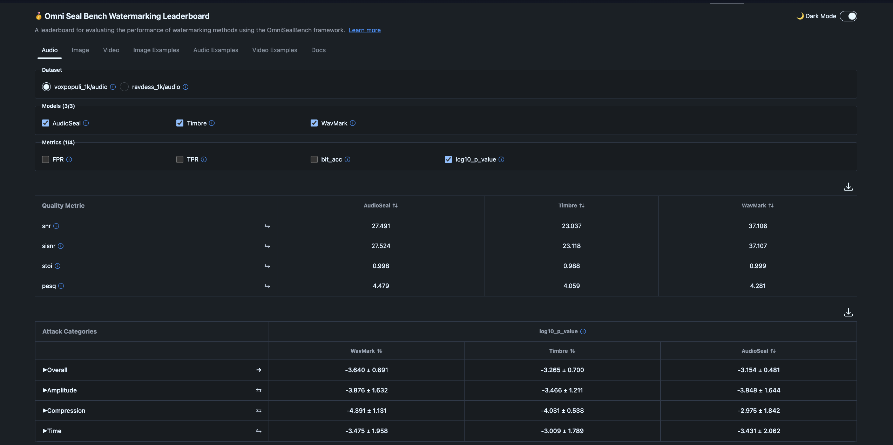

# OmniSeal Bench  📚

OmniSeal Bench is a framework that provides a comprehensive benchmark for evaluating the performance of neural watermarking techniques on image, video and audio contents. The benchmark includes a wide variety of datasets, attacks, evaluation metrics, and an analysis tool to compare different SOTA watermarking models.


## Documentation

For detailed information about the models and metrics used in **OmniSeal Bench**, please refer to the [documentation](docs/README.md). This section contains markdown files that describe each model (and how to download it) and metric in detail.


## 📜 Installation

### Quick installation

**OmniSeal Bench** can be installed from GitHub by cloning the repository and installing it. We recomend a fresh Conda/Python environment. Omniseal Bench was tested with Python>=3.10+ and PyTorch>=2.4. It is advisable to check your CUDA version and install a matching [PyTorch version](https://pytorch.org/get-started/previous-versions/) for it to have optimal performance.

```bash
conda create -n "omnisealbench" python=3.10 pip
conda activate omnisealbench

pip install torch==2.7.1 torchvision==0.22.1 torchaudio==2.7.1 \
    --index-url https://download.pytorch.org/whl/cu128

# Make sure to install FFMPEG for audio and video
# Alternatively, you can also 
# apt-get install ffmpeg
conda install -c conda-forge ffmpeg

# Clone the OmniSeal Bench repository and install it.
git clone https://github.com/facebookresearch/omnisealbench.git
cd omnisealbench

pip install omnisealbench[all] -e .
```

### Installing a specific modality:

You can install only a subset of **OmniSeal Bench** with less dependencies required.

- Audio watermarking only:

    `pip install omnisealbench[audio] -e .`

- Image watermarking only:

    `pip install omnisealbench[image] -e .`

- Video watermarking only:

    `pip install omnisealbench[video] -e .`

- Results analysis via a leaderboard:

    `pip install omnisealbench[leaderboard] -e .`


### [Internal FAIR notes - to be removed]: 

To test fairinternal/videoseal or audioseal, install the following extra libraries:

1. For Audioseal, if you want to evaluate internal checkpoints (i.e. for Llama4), install internal Audioseal instead. This is temporary and should be removed in the future, once we upstream all changes to public AudioSeal:

```
pip install git+https://github.com/fairinternal/audioseal.git
```

2. For fairinternal/video: Run  `pip install decord pycocotools timm einops opencv-python safetensors av` before installing from https://github.com/fairinternal/videoseal.git


### Downloading models

Before running any evaluation, if you want to use the registered models and the default model cards you need to download the checkpoints for the models that require that and dont provide automatic weights download. For this you can run one of the following commands depending on the modality you are using. Make sure to install [gdown](https://github.com/wkentaro/gdown) before running the scripts:
- audio:
```
bash scripts/download_audio_models.sh
```

- image:
```bash
bash scripts/download_image_models.sh
```
- The InvisMark repository provides a public OneDrive link for its checkpoint. This file must be downloaded manually, as automatic download is not supported.


By default, models are stored in the OMNISEAL_CHECKPOINTS location: $USER/.cache/omnisealbench/checkpoints.
To use a different location, set the environment variable:

```bash
export OMNISEAL_CHECKPOINTS=/path/to/your/checkpoints/location
```


## 🔥 Command Line Interface

### Basic usage:

To run the evaluation end-to-end, try the following quick examples. Ensure to download the models and set OMNISEAL_CHECKPOINTS beforehand.

[image]
```
omniseal eval image
    --dataset_dir=./examples/img
    --result_dir=./results/images
    --ids_to_save=all
    --attacks=all
    --metrics=all
    --model="wam,trustmark"
```

[audio]
```
omniseal eval audio
    --dataset_dir=./examples/audios
    --result_dir=./results/audios
    --ids_to_save=all
    --attacks=all
    --metrics=all
    --model="audioseal,timbre,wavmark_fast"
```

[video]

```
export FFMPEG_BINARY=... # Path to ffmpeg binary in the system, this will be required for VMAF metric computation
omniseal eval image
    --dataset_dir=./examples/videos
    --result_dir=./results/videos
    --ids_to_save=all
    --attacks=all
    --metrics=all
    --model=videoseal_1.0
```

**Notes**: 

- You can omit the parameter "--model" if you want to evaluate on all the registered models. See "src/omnisealbench/configs/
- `ids_to_save=all` will save all examples to the result dir. Other ways is to select a specific examples by ids, e.g. `ids_to_save=0,1,2,4`, or by range `ids_to_save=0-4`
- To limit the number of samples e.g. to one example, use `--num_samples=1`
- By default, Omniseal Bench will skip if the result directory exists with certain structure (see below). To force the rerun, specify `--overwrite=True`


### Result:

The result directory will look similar to something below (examples for audio):

```
📁 no-attack/
    📄 attack_results.jsonl
    📄 metrics.json
📁 updownresample/
    📄 attack_results.jsonl
    📄 metrics.json
📁 bandpass_filter/
    📄 attack_results.jsonl
    📄 metrics.json
📁 speed_julius__speed_1.25/
    📄 attack_results.jsonl
    📄 metrics.json
📁 pink_noise__noise_std_1.0/
    📄 attack_results.jsonl
    📄 metrics.json
📁 lowpass_filter__cutoff_freq_5000/
    📄 attack_results.jsonl
    📄 metrics.json
📁 mp3_compression__bitrate_256k/
    📄 attack_results.jsonl
    📄 metrics.json
📄 metrics.json
📄 report.csv
```

- The file "metrics.json" consists of average metrics for the whole dataset. For each metrics, it will report three values (in this order): average score, number of total examples evaluated over all attacks, and mean of square of the values. 
- "report.csv" stores the raw results of each example. In additiona to the metrics, each row also contains the attack name, attack category, and the parameters used in the attack (attack variant).
- For each attack, the results are stored in a sub-folder. There is a special attack - "identity" - that corresponds to "no attack", i.e. running the detection directly on the original and watermarked contents without transformation. Inside each of these sub-folder, "metrics.json" reports the average scores for the corresponding attack, while "attack_results.jsonl" is the raw results in JSONL format.


__Model cards__:

The model cards can be found in "src/omnisealbench/cards". IF you want to point to other model cards outside the code repo (e.g. in your own cluster), use the environment variable "OMNISEAL_MODEL_DIR" to store the model card directory.


### Advanced usage:

The Omniseal Bench CLI also provides an individual way to watermark content using the registered models, detect the embedded watermarks, and report various metrics. There are two main commands: 

1. `generate_watermark` watermarks content and evaluates the quality of it:

    ```bash
    omniseal eval [image|audio|video] generate_watermark [OPTIONS]
    ```

2. `detect_watermark` detects watermarks in, potentially altered, watermarked content and evaluates the robustness of the watermarking methods:

    ```bash
    omniseal eval [image|audio|video] detect_watermarks [OPTIONS]
    ```

Depending on the command, the `[OPTIONS]` vary. To learn which options are available, use `omniseal eval [image|audio|video] --help`.
More about in [advanced_usage](docs/advanced_usage.md).


### Environment variables:

- `OMNISEAL_HOME`: The home directory to store results of the omniseal runs. By default, this is set to `~/.cache/omnisealbench`.
- `OMNISEAL_DEBUG`: By default, the errors in CLI are shortened to avoid verbosity. To print the full stacktrace of the error in CLI mode, pass `OMNISEAL_DEBUG=1` when running Omniseal
- `OMNISEAL_MESSGE`: The messages are randomly generated by default. To reproduce the attacks completely, pass `OMNISEAL_MESSAGE='test'` when running Omniseal. This will ensure the message follows
a strict pattern that can be reproducible for every run.
- `OMNISEAL_MODEL_DIR`: Refer to the folder where all YAML cards are stored. This is handy for adding external model cards without checking out source code.
- `OMNISEAL_CHECKPOINTS`: When downloading baselines using the scripts in "scripts", by defaults, all checkpoints are saved to "~/.cache/omnisealbench/checkpoints". Set this environment to change the target location of downloaded baselines.


## ❤️  Supported Models

Full details: [Audio](docs/models/audio.md) , [Image](docs/models/image.md) , [Video](docs/models/video.md)

| Modality | Model                | Parameters / Notes                                                                                   |
|----------|----------------------|------------------------------------------------------------------------------------------------------|
| Audio    | AudioSeal            | `model_card_or_path`, `nbits`, `alpha`, `device`                                                     |
| Audio    | WavMark              | `model_name_or_path`, `nbits`, `one_shot`, `sample_rate`, `device`                                   |
| Image    | TrustMark            | `model_type`, `encoding_type`, `nbits`, `verbose`, `device`                                         |
| Image    | DCTDWT               | `device`                                             |
| Image    | HiDDeN               | `model_card_or_path`, `lambda_w`, `device`                       |
| Image    | InvisMark            | `model_card_or_path`, `detection_bits`, `device`                       |
| Image    | FNNS                 | `model_card_or_path`, `lambda_w`, `nsteps`, `data_aug`, `detection_bits`, `device` |
| Image    | MBRS                 | `model_card_or_path`, `nbits`, `scaler`, `device`                         |
| Image    | CIN                  | `model_card_or_path`, `nbits`, `scaler`, `device`                          |
| Image    | SSL WM               | `model_card_or_path`, `lambda_w`, `nsteps`, `data_aug`, `detection_bits`, `device`                         |
| Image    | WAM                  | `model_card_or_path`, `embedder_cfg_yaml`, `augmenter_cfg_yaml`, `extractor_cfg_yaml`, `do_attenuation`, `attenuation_cfg_yaml`, `scaling_w`, `color`, `interpolation`, `extractor_model`,  `detection_bits`, `nbits`, `device`                         |
| Video    | RivaGAN              | `model_card_or_path`, `seq_len`, `nbits`, `keep_last_frames`, `detection_bits`, `device`                   |
| Video    | VideoSeal            | `model_card_or_path`, `nbits`, `detection_bits`, `scaling_w`, `videoseal_chunk_size`, `videoseal_step_size`, `attenuation`, `attenuation_config`, `video_aggregation`, `videoseal_mode`, `lowres_attenuation`, `time_pooling_depth`, `img_size_proc`, `interpolation`, `device`           |


## 🔥 Scaling Evaluation on SLURM clusters:

To scale up the evaluation on SLURM with bigger dataset, simply add `--slurm` to the CLI commands. To specify the runtime configuration for the SLURM job:

### Example 6: Run evaluation of full HuggingFace dataset in SLURM jobs:

```bash
omniseal eval audio
    --dataset_type=hf   # Evaluate on a HuggingFace dataset
    --dataset_name=facebook/voxpopuli
    --dataset_hf_subset=en
    --dataset_split=test
    --result_dir=/tmp/tuantran/voxpopuli_audioseal
    --padding=fixed
    --max_length=160000
    --sample_rate=16000
    --message_size=16
    --metrics=all
    --overwrite
    --model=audioseal
    --model_card_or_path=audioseal_wm_16bits
    --num_samples 1000
    --slurm
    --slurm.[OPTONS]=[VALUE]
```

### SLURM Options

The following table describes the available options for configuring SLURM jobs. (See `omnisealbench.commands.utils.SlurmOptions`):

| Options           | Description                                                                 |
|-------------------|-----------------------------------------------------------------------------|
| `partition`       | Name of the SLURM partition to submit the job to.                           |
| `qos`             | QOS for the SLURM job                                                       |
| `account`         | Account to submit the SLURM job                                             |
| `log_dir`         | Directory to store submitit jobs                                            |
| `nodes`           | Number of nodes to allocate for the job.                                    |
| `mem_gb`          | Amount of memory (in GB) to allocate per node.                              |
| `mem_per_cpu`     | Amount of memory (in GB) to allocate for each CPU in the node.              |
| `gpus_per_node`   | Number of GPUs to allocate per node.                                        |
| `timeout_min`     | Maximum runtime for the job in minutes.                                     |
| `job_name`        | Name to assign to the SLURM job.                                            |
| `cpus_per_task`   | Number of CPU cores to allocate per task.                                   |
| `tasks_per_node`  | Number of tasks to run on each node.                                        |


## 🔥 Omniseal Bench leaderboard

Once we run an evaluation we can load the raw results, aggregate them and visualise examples into omnisealbench_space by pointing to the evaluation results directory. Omniseal Bench leaderboard is hosted in [HuggingFace space](https://huggingface.co/spaces/facebook/omnisealbench), but you can also run it locally by following the steps below. This is handy if you want to inspect your own data without uploading to public storages.


### Step 1: Installation

Leaderboard is provided as a submodule in Omniseal Bench, run:

```
git submodule update --recursive
```

to get its source. Next, you can either setup a Docker image to run it on your own, or install `pip install [image,leaderboard] -e .` to run the leaderboard in the same environment. The following steps assume you run directly in your (Conda) environment. For Docker build, please see see README in src/leaderboard_space.


### Step 2: Run the leaderboard locally

```
cd src/leaderboard_space
gunicorn --chdir backend -b 0.0.0.0:7860 app:app --reload
```

Then open browser and navigate to "http://localhost:7860", you should see something like this:




### Step 2: Export evaluation results:

Run:

```
omniseal leaderboard export \
    --modality=image
    --source=results/images \
    --samples=all \
    --dataset_label=my_dataset
```

This will save all examples in the HF-leaderboard compatible format to a subfolder name "my_dataset" inside "src/leaderboard_space/backend/data".

Now refresh the browser and go to "Image" tab, you should see "my_dataset" listed there. CLick to it and switch to "Image Examples". The leaderboard
will reload the results with your evaluation and dataset. Have fun analysing :) !


## 🔥 Omniseal Bench Python API

Besides command line interface, Omniseal Bench is also equipped with a rich set of Python APIs. Please check the notebooks in the folder "[notebooks](./notebooks/)" for
example usage.


## 🙏 Acknowledgement
 tbd